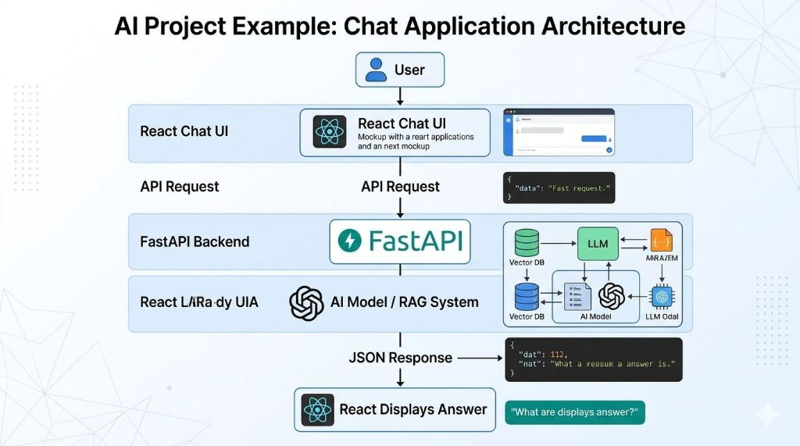

<div align="center">

# 🏛️ Nepal Constitution Chatbot — Backend

### *RAG-Powered AI API for the Constitution of Nepal (2015)*

[](https://python.org)
[](https://fastapi.tiangolo.com)
[](https://www.langchain.com)
[](https://groq.com)
[](https://www.trychroma.com)
[](LICENSE)

---

> **Instantly answer any question about Nepal's Constitution of 2015 using a hybrid RAG pipeline — semantic vector search + BM25 keyword search — powered by Groq's ultra-fast LLaMA 3.3 70B.**

</div>

---

## 🏗️ System Architecture



> *The above diagram illustrates the full-stack architecture: React Chat UI → API Request → FastAPI Backend → AI Model / RAG System → JSON Response → React Displays Answer.*

---

## ✨ Features

| Feature | Description |
|---|---|
| ⚡ **Blazing Fast Inference** | Powered by Groq's hardware-accelerated LLaMA 3.3 70B model |
| 🔍 **Hybrid Search (RAG)** | Combines BM25 keyword search + ChromaDB semantic search via EnsembleRetriever |
| 🧠 **Singleton RAG Chain** | Thread-safe pipeline initialization — built once, reused on every request |
| 📄 **PDF Ingestion** | Auto-loads & splits the official Constitution of Nepal PDF into 1000-char chunks |
| 💾 **Persistent Vector Store** | ChromaDB persists embeddings to disk — no re-embedding on restart |
| 🌐 **REST API** | Clean FastAPI endpoints with Pydantic models and automatic Swagger UI |
| 🔒 **CORS Configured** | Ready for React dev server on ports `5173` & `3000` |
| 📖 **Auto Docs** | Interactive Swagger UI at `/docs` and ReDoc at `/redoc` |

---

## 📁 Project Structure

```
backend/
├── main.py                      # FastAPI app — routes, CORS, Pydantic models
├── rag_engine.py                # RAG pipeline — PDF loading, embeddings, retrieval, LLM
├── requirements.txt             # All Python dependencies
├── .env                         # Environment variables (GROQ_API_KEY)
├── .gitignore                   # Ignores venv, .env, __pycache__, chroma_db
├── consituition of nepal.pdf    # Source document — Constitution of Nepal 2015
├── chroma_db/                   # Persisted vector store (auto-generated)
└── myenv/                       # Python virtual environment (local)
```

---

## 🔄 RAG Pipeline — How It Works

```
📄 PDF (Constitution of Nepal 2015)
        │
        ▼
🔪 Text Splitter (RecursiveCharacterTextSplitter)
   chunk_size=1000  |  chunk_overlap=150
        │
        ├──────────────────────────────────────────┐
        ▼                                          ▼
🔢 HuggingFace Embeddings                  📝 BM25 Retriever
   (all-MiniLM-L6-v2, local CPU)              (keyword search, k=10)
        │
        ▼
💾 ChromaDB Vector Store
   (semantic search, k=4)
        │
        └──────────────── EnsembleRetriever ──────┘
                         weights: [BM25=0.3, Vector=0.7]
                                  │
                                  ▼
                      🤖 Groq LLM (LLaMA 3.3 70B)
                         temperature=0.3
                                  │
                                  ▼
                         💬 Final Answer
```

---

## 🚀 Getting Started

### Prerequisites

- Python 3.10 or higher
- A free [Groq API Key](https://console.groq.com)
- Git

### 1️⃣ Clone the Repository

```bash
git clone https://github.com/your-username/constitution-chatbot.git
cd constitution-chatbot/backend
```

### 2️⃣ Create & Activate Virtual Environment

```bash
# Windows
python -m venv myenv
myenv\Scripts\activate

# macOS / Linux
python -m venv myenv
source myenv/bin/activate
```

### 3️⃣ Install Dependencies

```bash
pip install -r requirements.txt
```

### 4️⃣ Configure Environment Variables

Create a `.env` file in the `backend/` directory:

```env
GROQ_API_KEY="your_groq_api_key_here"
```

> 🔑 Get your free API key at [console.groq.com](https://console.groq.com)

### 5️⃣ Run the Server

```bash
uvicorn main:app --reload --port 8001
```

The API will be live at: **`http://localhost:8001`**

---

## 🌐 API Reference

### Base URL
```
http://localhost:8001
```

### Endpoints

#### `GET /` — Health Check
```bash
curl http://localhost:8001/
```
**Response:**
```json
{
  "status": "ok",
  "service": "Nepal Constitution Chatbot API"
}
```

---

#### `POST /chat` — Ask a Question
```bash
curl -X POST http://localhost:8001/chat \
  -H "Content-Type: application/json" \
  -d '{"message": "What are the fundamental rights in the Constitution of Nepal?"}'
```
**Request Body:**
```json
{
  "message": "What are the fundamental rights in the Constitution of Nepal?"
}
```
**Response:**
```json
{
  "answer": "The Constitution of Nepal (2015) guarantees several fundamental rights under Part 3, Articles 16-46. These include: the right to live with dignity (Article 16), the right to freedom (Article 17), the right to equality (Article 18)..."
}
```

---

#### `GET /docs` — Swagger UI (Interactive API Docs)
Visit: [http://localhost:8001/docs](http://localhost:8001/docs)

#### `GET /redoc` — ReDoc API Documentation
Visit: [http://localhost:8001/redoc](http://localhost:8001/redoc)

---

## 📦 Dependencies

| Package | Purpose |
|---|---|
| `fastapi` | High-performance async web framework |
| `uvicorn` | ASGI server for FastAPI |
| `langchain` | LLM orchestration framework |
| `langchain-core` | Core LangChain abstractions |
| `langchain-community` | Community integrations (PDF, Chroma, BM25) |
| `langchain-classic` | EnsembleRetriever & retrieval chain utilities |
| `langchain-text-splitters` | Document chunking utilities |
| `langchain-huggingface` | HuggingFace embeddings integration |
| `langchain-groq` | Groq LLM integration |
| `chromadb` | Local vector database |
| `sentence-transformers` | `all-MiniLM-L6-v2` embedding model |
| `pypdf` | PDF document loader |
| `rank_bm25` | BM25 keyword search algorithm |
| `python-dotenv` | `.env` file loader |

---

## ⚙️ Configuration

| Variable | Default | Description |
|---|---|---|
| `GROQ_API_KEY` | *(required)* | Your Groq API key |
| `PDF_PATH` | `consituition of nepal.pdf` | Path to the constitution PDF |
| `DB_PATH` | `./chroma_db` | ChromaDB persistence directory |
| `chunk_size` | `1000` | Characters per text chunk |
| `chunk_overlap` | `150` | Overlap between consecutive chunks |
| `LLM model` | `llama-3.3-70b-versatile` | Groq LLM model ID |
| `temperature` | `0.3` | LLM response randomness |
| `vector k` | `4` | Top-k results from vector store |
| `bm25 k` | `10` | Top-k results from BM25 retriever |
| `BM25 weight` | `0.3` | BM25 weight in ensemble retrieval |
| `Vector weight` | `0.7` | Vector search weight in ensemble retrieval |

---

## 🛡️ Error Handling

| HTTP Status | Scenario |
|---|---|
| `200 OK` | Successful response with answer |
| `400 Bad Request` | Empty message body sent |
| `500 Internal Server Error` | PDF not found / Groq API failure / pipeline error |

---

## 🧪 Testing the RAG Engine Directly

```bash
python rag_engine.py
```
This will run a standalone test query:
> *"What is the summary of the fundamental rights?"*

---

## 🔗 Related

- 📱 [Frontend — React Chat UI](../frontend/README.md)
- 📜 [Constitution of Nepal (Official)](https://www.lawcommission.gov.np)
- 🤖 [Groq Console](https://console.groq.com)
- 🔗 [LangChain Docs](https://docs.langchain.com)

---

<div align="center">

**Made with ❤️ for the people of Nepal 🇳🇵**

*Empowering citizens with easy access to their constitutional rights*

</div>
